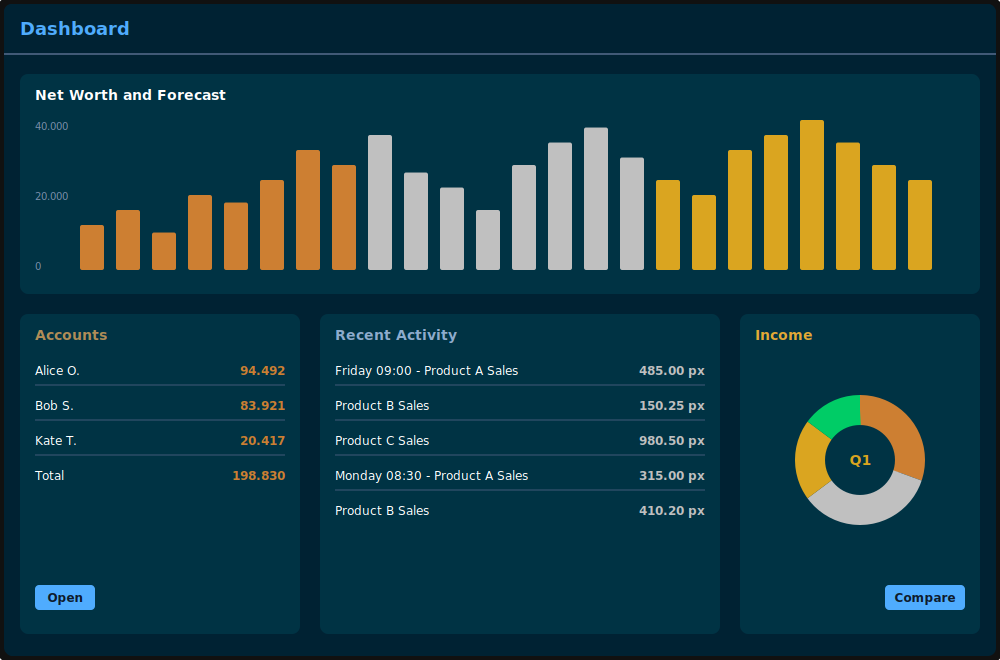

  

<h1 align="left">Hi , I'm  Roberto souza</h1> 
 

# 🔥  - Data Engineer
 
🎯 **Objetivo**  
Este portfólio reúne projetos pessoais de **Análise de Dados** e **Engenharia de Dados**, demonstrando minha capacidade de resolver desafios de negócios por meio de análises inteligentes e soluções escaláveis.

# 🚀 **Sobre Mim**
Analista de Dados BI | Transformando Dados em Estratégias com Impacto Tangível

Analista de BI  com mais de 4 anos de experiência na construção de pipelines de dados e soluções analíticas que suportam decisões críticas de negócios.  Trabalhei em grandes empresas e ambientes de consultoria, incluindo Petrobras e empresas de consultoria com foco em dados, entregando soluções de BI ponta a ponta, desde extração de dados até painéis executivos.

---

# 💡 **Habilidades**

### **🔍 Análise de Dados**  

📊 Power BI: Desenvolvimento de dashboards interativos e painéis executivos de alto impacto. Aplicação de data storytelling com lógica Top-Down estruturada, construção de métricas complexas utilizando a linguagem DAX e otimização rigorosa de modelos semânticos para garantir máxima performance e clareza na tomada de decisão.

🗄️ SQL Server: Gerenciamento, manipulação e otimização estrutural de bancos de dados relacionais. Foco em performance tuning, criação de views e stored procedures, assegurando uma arquitetura de dados estável, segura e veloz para suportar o ambiente analítico.

🔄 Pentaho Data Integration (PDI): Construção e orquestração de soluções robustas de ETL. Automação de pipelines para extrair dados de múltiplas origens, aplicar transformações e regras de negócio complexas, e carregar informações limpas e padronizadas no Data Warehouse.

💻 SQL: Domínio na criação de consultas avançadas e em modelagem dimensional. Uso intensivo da linguagem para exploração de dados, lógicas de tratamento e estruturação de tabelas fato e dimensão, garantindo a integridade da base que alimenta a camada de visualização.

- 👨‍💻 Projetos em Power BI [Power BI](https://sites.google.com/view/portfoliorobertosouza/home)

# **⚙️ Engenharia de Dados**  

## 📊 **Arquitetura de Engenharia de Dados**

.svg)
-⚙️ Azure Data Factory: Orquestração, integração e automação de pipelines de dados em nuvem, fundamental para construir fluxos de ETL/ELT confiáveis.

🔥 PySpark: Motor de processamento distribuído utilizado para tarefas de engenharia de dados em larga escala, transformações complexas e análise de Big Data com alta velocidade.

⚡ Microsoft Fabric: Plataforma SaaS unificada (all-in-one) de ponta a ponta que centraliza engenharia, integração e visualização de dados. Automatiza e otimiza tarefas desde o processamento no OneLake até o consumo no BI, quebrando silos de dados e tornando os fluxos de trabalho incrivelmente mais eficientes e escaláveis.
 
# 🛠 &nbsp;Projetos
 - 🔭 Projeto [Projeto Soluões Fabric](https://github.com/Robertofsouzas/solucoes-fabric)
 - 🔭 Projeto [Consolidação de faturas](https://github.com/Robertofsouzas/ConsolidacaoDeFaturas)
 - 🔭 Projeto [Relatório_Financeiro](https://github.com/Robertofsouzas/Git-fabric)
 - 🔭 Projeto [LojaVrinda](https://github.com/Robertofsouzas/LojaVrinda/tree/main)
 - 🔭 Projeto [Healthcare-Dataset](https://github.com/Robertofsouzas/Healthcare-Dataset)
 - 🔭 Projeto [Analise de cesta de Compra](https://github.com/Robertofsouzas/Analise_Cesta_de_Compras)
 - 🔭 Projeto [Pre-Processamento de dados no Mongodb](https://github.com/Robertofsouzas/Pre-Processamento-de-dados-de-texto-Extraido-do-Mongodb)
 - 🔭 Projeto [Análise e Limpeza dos dados](https://github.com/Robertofsouzas/Analise-e-Limpeza-de-Dados-)

- 🔭 Projeto [Modern data stack](https://github.com/Robertofsouzas/modern-data-stack)

- 🤝 Atualmente estou trabalhando nesse projeto [Previsão de vendas na loja](https://github.com/Robertofsouzas/DatascienceEmproducao)

- 📫 How to reach me **Robertofonsecas83@gmail.com**

<h3 align="left">Languages and Tools:</h3>

 
  
   
  
   
  
 
  
  

  

## ⚙️ &nbsp;GitHub Analytics

 

<h3 align="left">Connect with me:</h3>

  
  
  
  
  

